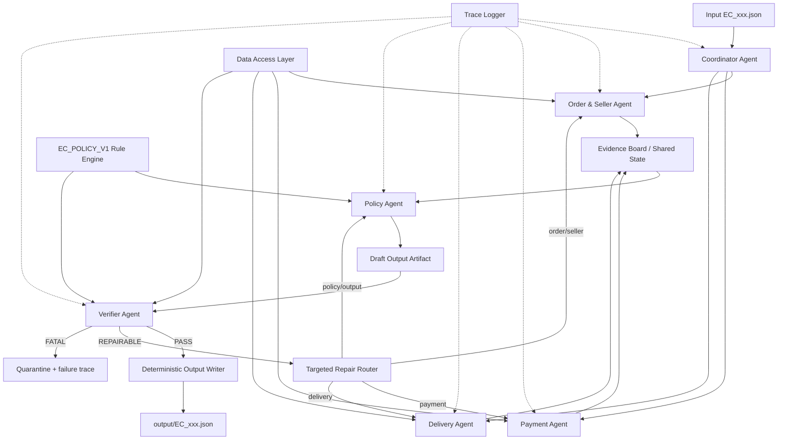

# Thiết kế hệ thống Multi-Agent giải quyết tranh chấp thương mại điện tử

> **Bài toán:** K3 Day 09 — Multi-Agent E-commerce Dispute Resolution  
> **Model thống nhất:** `openai/gpt-4o-mini` qua OpenRouter  
> **Loại tài liệu:** Thiết kế kiến trúc và contract tham chiếu cho mã triển khai  
> **Phiên bản:** 1.0  
> **Ngày khảo sát:** 2026-08-05

---

## 1. Tóm tắt quyết định thiết kế

Hệ thống được thiết kế theo mô hình **multi-agent có điều phối bằng đồ thị trạng thái**, trong đó mỗi agent sở hữu một miền dữ liệu, tập công cụ và schema đầu ra riêng. Các agent không trò chuyện tự do trong một group chat chung. Thay vào đó, chúng trao đổi qua các **handoff message có cấu trúc**, được lưu vào shared state và kiểm tra bằng JSON Schema.

Kiến trúc đề xuất gồm sáu agent:

1. **Coordinator Agent** — đọc case, lập kế hoạch điều tra và điều phối các nhánh.
2. **Order & Seller Agent** — kiểm tra order, item, seller và mốc seller bàn giao.
3. **Payment Agent** — tính tổng payment, tổng item, freight và đối soát tài chính.
4. **Delivery Agent** — xác định giao trễ, giao đúng hạn và nguyên nhân seller/logistics.
5. **Policy Agent** — áp dụng `EC_POLICY_V1` theo đúng thứ tự ưu tiên và dựng draft output.
6. **Verifier Agent** — tái tính toán độc lập, kiểm tra evidence ID, schema, giới hạn và số tiền.

Một **Data Access Layer** không dùng LLM chịu trách nhiệm đọc CSV một lần, chuẩn hóa kiểu dữ liệu, lập chỉ mục theo `order_id` và cung cấp các tool read-only cho agent. Một **Deterministic Output Writer** chỉ ghi JSON khi Verifier trả về `PASS`.

Thiết kế này chủ động đặt LLM vào vai trò phân tích, tổng hợp và handoff; còn join dữ liệu, phép tính tiền, kiểm tra policy và validation bắt buộc được hỗ trợ bởi công cụ xác định. Mục tiêu là tạo ra hệ thống multi-agent thật nhưng không biến một bài toán có quy tắc rõ ràng thành hội thoại LLM khó kiểm soát.

---

## 2. Yêu cầu được rút ra từ đề bài

### 2.1. Yêu cầu chức năng

Hệ thống phải xử lý đúng 50 case từ `EC_001.json` đến `EC_050.json`. Với mỗi case, hệ thống cần:

- Truy xuất order theo `customer_request.claimed_order_id`.
- Join order với items, payments và seller liên quan.
- Xác định một trong sáu `primary_issue` của `EC_POLICY_V1`.
- Xác định `case_status`, root cause, bên chịu trách nhiệm, evidence, số tiền và action.
- Tạo đúng một output JSON có tên trùng với input.
- Ghi trace chạy thật vào `trace.jsonl`.
- Ghi model, framework và runtime vào `metadata.json`.

### 2.2. Yêu cầu chất lượng

- Không mặc định nội dung khiếu nại là đúng.
- Không tạo evidence không tồn tại trong CSV hoặc policy.
- Không nhân `payment_value` với `payment_installments`.
- Không lấy một payment row hoặc item row đại diện cho toàn order.
- Không loại order `unavailable` chỉ vì không có item.
- Không join trực tiếp geolocation làm nhân bản dòng.
- Mọi số tiền dùng `Decimal`, quantize hai chữ số thập phân.
- Policy phải được áp dụng đúng thứ tự ưu tiên.
- Output phải tuân thủ giới hạn số phần tử của đề bài.

### 2.3. Đặc điểm dữ liệu ảnh hưởng trực tiếp đến kiến trúc

Theo tài liệu phân tích dữ liệu:

- Cả 50 `claimed_order_id` đều tồn tại trong orders.
- Có 8 order `unavailable` không có item row nhưng có payment.
- Có 9 case nhiều payment row và tất cả là split payment hợp lệ.
- Bộ case không có order nhiều seller, nhưng thiết kế vẫn phải tổng quát theo seller.
- Quyết định của sáu nhánh policy chủ yếu cần orders, order items và payments.
- Products, reviews, customers, sellers và geolocation chỉ là dữ liệu bổ sung, không nên được cấp quyền mặc định cho mọi agent.

---

## 3. Khảo sát hướng kiến trúc

### 3.1. Custom Python finite-state workflow

**Ưu điểm:** ít dependency, dễ kiểm soát, nhanh.  
**Nhược điểm:** phải tự xây persistence, retry, state transition, trace và visualization; khó thể hiện rõ subgraph/handoff khi bài cần chấm tính multi-agent.

### 3.2. AutoGen group chat hoặc selector group chat

AutoGen hỗ trợ team trong đó model chọn speaker tiếp theo và các thành viên chia sẻ ngữ cảnh chung. Kiểu kiến trúc này phù hợp với bài toán mở, cần thảo luận và chọn agent động.

**Không chọn làm kiến trúc chính** vì bài hiện tại có số nhánh cố định, policy xác định và cần output JSON rất chặt. Group chat làm tăng token, khó giới hạn context, có nguy cơ lặp hội thoại, thay đổi thứ tự agent và làm mờ nguồn gốc bằng chứng.

### 3.3. LangGraph custom workflow

LangGraph mô hình hóa workflow dưới dạng graph, cho phép kết hợp node agentic với node xác định, điều kiện chuyển trạng thái, parallel branches, retry và checkpoint. Tài liệu multi-agent của LangChain cũng khuyến nghị custom workflow khi cần trộn deterministic logic và agent behavior.

**Chọn làm framework orchestration đề xuất** vì phù hợp nhất với bài:

- Có luồng cố định nhưng vẫn có handoff giữa agent.
- Có thể chạy ba specialist agent song song.
- Mỗi node nhận state tối thiểu theo nguyên tắc least privilege.
- Có conditional edge từ Verifier đến repair hoặc finalize.
- Dễ sinh trace theo node và case.

### 3.4. Agent2Agent Protocol

A2A là giao thức phục vụ khả năng tương tác giữa các agent độc lập, sử dụng các khái niệm như Agent Card, Task, Message, Part và Artifact. Với bài lab chạy trong cùng một repo/process, triển khai đầy đủ A2A server qua HTTP là không cần thiết và làm tăng độ phức tạp.

Thiết kế này **áp dụng A2A-inspired contracts ở mức nội bộ**:

- Mỗi agent có Agent Card.
- Coordinator tạo Task cho specialist.
- Specialist trả Message có payload schema xác định.
- Policy Agent tạo Artifact là draft output.
- Verifier tạo Artifact là verification report.

Khi cần tách agent thành service riêng trong tương lai, các contract này có thể ánh xạ sang A2A chính thức mà không phải thiết kế lại nghiệp vụ.

### 3.5. Kết luận khảo sát

| Tiêu chí | Custom FSM | AutoGen Group Chat | LangGraph Custom Workflow | Full A2A Services |
|---|---:|---:|---:|---:|
| Determinism | Cao | Thấp–trung bình | Cao | Cao |
| Handoff rõ ràng | Trung bình | Có nhưng nhiều context | Rất rõ | Rất rõ |
| Parallel specialist | Tự xây | Có | Có | Có |
| Structured state | Tự xây | Phụ thuộc message | Tốt | Tốt |
| Chi phí token | Thấp | Cao | Thấp–trung bình | Trung bình |
| Phù hợp bài lab | Khá | Trung bình | **Tốt nhất** | Quá nặng |

**Quyết định:** dùng **LangGraph custom workflow + Pydantic/JSON Schema + OpenRouter structured outputs + A2A-inspired message envelope**.

---

## 4. Nguyên tắc kiến trúc

### 4.1. Agent phân tích, tool xác minh

Agent không được tự đọc toàn bộ CSV bằng prompt. Agent chỉ gọi tool read-only và nhận dữ liệu đã chuẩn hóa. Phép cộng tiền, so sánh timestamp, đối soát và tạo evidence ID phải có hàm xác định để agent sử dụng.

### 4.2. Least privilege

Mỗi agent chỉ được nhận dữ liệu cần thiết:

| Agent | Dữ liệu được truy cập |
|---|---|
| Coordinator | Input case, danh sách capability của agent |
| Order & Seller | orders, items, seller IDs |
| Payment | items và payments của đúng order |
| Delivery | delivery timestamps, shipping limits và seller mapping |
| Policy | Kết quả có cấu trúc của ba specialist, policy version |
| Verifier | Input case, raw order view tối thiểu, policy table, draft output |

Products, reviews và geolocation không nằm trong đường quyết định chính.

### 4.3. Không chia sẻ chain-of-thought

Handoff chỉ chứa:

- Kết luận có cấu trúc.
- Các phép tính và giá trị quan sát được.
- Evidence references.
- Cảnh báo dữ liệu thiếu hoặc mâu thuẫn.

Không ghi reasoning nội bộ dài hoặc chain-of-thought vào trace.

### 4.4. Policy-as-code là nguồn sự thật cuối

Policy Agent có thể giải thích và chọn rule, nhưng Verifier phải chạy lại `EC_POLICY_V1` bằng rule engine xác định. Khi LLM và rule engine khác nhau, rule engine thắng và case được gửi qua targeted repair.

### 4.5. Idempotent và reproducible

- Mỗi lần chạy tạo mới `trace.jsonl`, không append vào trace cũ.
- Output được ghi atomic qua file tạm rồi rename.
- Cùng input, data snapshot, model config và seed phải cho cấu trúc quyết định ổn định.
- `temperature = 0` hoặc giá trị nhỏ nhất provider hỗ trợ.

---

## 5. Kiến trúc tổng thể



### 5.1. Execution plane

Chứa Coordinator, specialist agents, Policy Agent, Verifier và repair router.

### 5.2. Data plane

Chứa Data Catalog, normalized order views, indexes và evidence registry.

### 5.3. Governance plane

Chứa schema registry, policy engine, trace logger, retry policy, output validator và metadata recorder.

---

## 6. Luồng xử lý một case

```mermaid
sequenceDiagram
    participant R as Runner
    participant C as Coordinator
    participant O as OrderSeller
    participant P as Payment
    participant D as Delivery
    participant Y as Policy
    participant V as Verifier
    participant W as Writer

    R->>C: CaseTask(case_id, claimed_order_id, policy_version)
    C-->>O: InvestigateOrderSellerTask
    C-->>P: ReconcilePaymentTask
    C-->>D: AnalyzeDeliveryTask

    par Domain analysis
        O->>O: Call order/item tools
        O-->>C: OrderSellerFinding
    and
        P->>P: Call payment tools
        P-->>C: PaymentFinding
    and
        D->>D: Call delivery tools
        D-->>C: DeliveryFinding
    end

    C->>Y: PolicyDecisionTask + three findings
    Y-->>C: DraftResolutionArtifact
    C->>V: VerifyTask + draft + evidence refs
    V->>V: Re-query data and run policy-as-code

    alt PASS
        V-->>W: VerifiedOutput
        W-->>R: output/EC_xxx.json
    else REPAIRABLE
        V-->>C: RepairDirective(field, owner_agent, reason)
        C->>O: Targeted retry example
        O-->>C: Corrected finding
        C->>Y: Rebuild draft
        Y-->>V: Revised draft
    else FATAL
        V-->>R: Failure report; do not write invalid JSON
    end
```

### 6.1. Parallelism

`Order & Seller`, `Payment` và `Delivery` chạy song song bằng fan-out/fan-in. Điều này tạo handoff thật mà không phụ thuộc vào speaker selection của LLM.

### 6.2. Repair budget

Mỗi case chỉ có tối đa:

- 1 lần retry kỹ thuật cho từng API call.
- 1 vòng targeted repair nghiệp vụ sau Verifier.
- Không quá 8 model calls/case.

Nếu vẫn không pass, case được đánh dấu `fatal_validation_error` trong trace và runner dừng trước khi đóng gói submission.

---

## 7. Shared state

```python
CaseState = {
    "run_id": str,
    "case": InputCase,
    "task_plan": InvestigationPlan | None,
    "order_seller_finding": OrderSellerFinding | None,
    "payment_finding": PaymentFinding | None,
    "delivery_finding": DeliveryFinding | None,
    "draft_resolution": OutputCase | None,
    "verification": VerificationReport | None,
    "repair_count": int,
    "status": Literal[
        "received", "investigating", "policy_pending",
        "verification_pending", "repairing", "verified", "failed"
    ],
    "errors": list[StructuredError]
}
```

Shared state chỉ chứa structured data. Không lưu nguyên toàn bộ prompt hoặc toàn bộ CSV row ngoài phạm vi case.

---

## 8. A2A-inspired handoff contract

Mọi message nội bộ sử dụng envelope sau:

```json
{
  "protocol_version": "internal-a2a/1.0",
  "message_id": "msg_<uuid>",
  "correlation_id": "<run_id>:<case_id>",
  "parent_message_id": null,
  "from_agent": "coordinator",
  "to_agent": "payment_agent",
  "intent": "reconcile_payment",
  "payload_type": "PaymentInvestigationTask.v1",
  "payload": {},
  "evidence_refs": [],
  "constraints": {
    "policy_version": "EC_POLICY_V1",
    "max_evidence": 10,
    "currency": "BRL"
  },
  "status": "submitted",
  "created_at": "<ISO-8601>"
}
```

### 8.1. Quy tắc handoff

- `payload_type` luôn có version.
- Agent nhận không được dựa vào trường không có trong payload hoặc tool result.
- `evidence_refs` chỉ dùng định dạng hợp lệ của đề.
- Mọi message có `correlation_id` để ghép trace theo case.
- Agent trả lỗi bằng `StructuredError`, không trả câu văn tự do.

### 8.2. StructuredError

```json
{
  "error_code": "MISSING_REQUIRED_TIMESTAMP",
  "severity": "warning",
  "owner_agent": "delivery_agent",
  "field": "order_delivered_customer_date",
  "message": "Required timestamp is absent in source data",
  "retryable": false
}
```

---

## 9. Agent Cards

### 9.1. Coordinator Agent

**Mục tiêu:** tạo kế hoạch điều tra và điều phối, không tự kết luận nghiệp vụ.

**Input:** `InputCase`, policy version, capability registry.  
**Tools:** không truy cập CSV trực tiếp.  
**Output:** `InvestigationPlan`.

```json
{
  "required_agents": [
    "order_seller_agent",
    "payment_agent",
    "delivery_agent"
  ],
  "claimed_order_id": "...",
  "policy_version": "EC_POLICY_V1",
  "execution_mode": "parallel",
  "risk_flags": []
}
```

**Prompt guardrails:**

- Không đoán primary issue.
- Không tin claim là factual evidence.
- Luôn dispatch đủ ba specialist cho mọi case để trace đồng nhất.
- Chỉ đưa dữ liệu tối thiểu cho từng agent.

### 9.2. Order & Seller Agent

**Mục tiêu:** xác minh trạng thái order, danh sách item, seller, shipping limit và seller handoff.

**Tools:**

- `get_order(order_id)`
- `get_order_items(order_id)`
- `group_items_by_seller(order_id)`
- `build_order_evidence(order_id)`

**Output:**

```json
{
  "order_id": "...",
  "order_found": true,
  "order_status": "delivered",
  "item_ids": ["<order_id>:1"],
  "seller_ids": ["<seller_id>"],
  "seller_handoff": [
    {
      "seller_id": "<seller_id>",
      "item_ids": ["<order_id>:1"],
      "latest_shipping_limit": "2018-01-01 00:00:00",
      "carrier_handoff_at": "2018-01-02 00:00:00",
      "handoff_after_any_item_limit": true,
      "violating_item_ids": ["<order_id>:1"]
    }
  ],
  "evidence_ids": [
    "order:<order_id>",
    "item:<order_id>:1",
    "seller:<seller_id>"
  ],
  "data_quality_flags": []
}
```

**Quy tắc:**

- Nếu không có item, `item_ids`, `seller_ids`, `seller_handoff` rỗng.
- Seller vi phạm nếu carrier date muộn hơn shipping limit của ít nhất một item thuộc seller đó.
- Không chọn một item đại diện.
- Không dùng products hoặc geolocation để xác định trách nhiệm.

### 9.3. Payment Agent

**Mục tiêu:** đối soát toàn bộ payment row với tổng item và freight.

**Tools:**

- `get_order_items(order_id)`
- `get_order_payments(order_id)`
- `calculate_financial_totals(order_id)`
- `build_payment_evidence(order_id)`

**Output:**

```json
{
  "order_id": "...",
  "payment_ids": ["<order_id>:1", "<order_id>:2"],
  "payment_row_count": 2,
  "item_total_brl": "100.00",
  "freight_total_brl": "15.00",
  "expected_total_brl": "115.00",
  "payment_total_brl": "115.00",
  "reconciliation_delta_brl": "0.00",
  "reconciled_within_0_10": true,
  "has_split_payment": true,
  "has_items": true,
  "evidence_ids": [
    "payment:<order_id>:1",
    "payment:<order_id>:2"
  ],
  "data_quality_flags": []
}
```

**Quy tắc:**

- `payment_total = SUM(payment_value)`.
- Không nhân với installments.
- `expected_total = SUM(price) + SUM(freight_value)`.
- So sánh bằng `abs(delta) <= Decimal("0.10")`.
- Với order không có item, trả totals item/freight bằng `0.00`, nhưng không tự đánh dấu payment lỗi.

### 9.4. Delivery Agent

**Mục tiêu:** xác định order có giao trễ hay không và phân biệt seller với logistics.

**Tools:**

- `get_delivery_timeline(order_id)`
- `get_shipping_limits_by_seller(order_id)`
- `compare_timestamps(order_id)`

**Output:**

```json
{
  "order_id": "...",
  "delivered_customer_at": "2018-01-10 00:00:00",
  "estimated_delivery_at": "2018-01-08 00:00:00",
  "delivered_late": true,
  "late_days": "2.00",
  "carrier_handoff_at": "2018-01-05 00:00:00",
  "seller_handoff_late": false,
  "violating_seller_ids": [],
  "delivery_attribution": "logistics_provider",
  "evidence_ids": ["order:<order_id>"],
  "data_quality_flags": []
}
```

**Quy tắc:**

- `delivered_late = delivered_customer_date > estimated_delivery_date`.
- Chỉ gán logistics khi giao trễ và không seller nào bàn giao trễ.
- Nếu order chưa delivered, không suy diễn delivery attribution.
- Không tạo tracking checkpoint không tồn tại.

### 9.5. Policy Agent

**Mục tiêu:** áp policy theo thứ tự ưu tiên và tạo draft output đúng schema.

**Input:** ba specialist findings và policy table đã version hóa.  
**Tools:**

- `evaluate_policy_v1(findings)`
- `calculate_recommended_refund(rule, totals)`
- `build_evidence_set(rule, findings)`
- `validate_output_schema(draft)`

**Policy order bắt buộc:**

1. `canceled_order_paid`
2. `unavailable_order_paid`
3. `late_delivery_seller`
4. `late_delivery_logistics`
5. `valid_split_payment`
6. `unsupported_late_claim`

**Không cho phép:** chọn nhánh dựa vào độ giống ngữ nghĩa giữa claim và tên issue. Claim chỉ là mục tiêu điều tra.

### 9.6. Verifier Agent

**Mục tiêu:** đóng vai trò kiểm toán độc lập, không tin trực tiếp draft hoặc specialist summary.

**Tools:**

- Toàn bộ read-only tools cần thiết cho đúng `order_id`.
- `evaluate_policy_v1` độc lập.
- `validate_evidence_registry`.
- `validate_output_limits`.
- `validate_financial_arithmetic`.
- `validate_entity_consistency`.

**Output:**

```json
{
  "verdict": "PASS",
  "checked_rule": "late_delivery_seller",
  "checks": [
    {"name": "schema", "passed": true, "details": ""},
    {"name": "policy_priority", "passed": true, "details": ""},
    {"name": "financial_totals", "passed": true, "details": ""},
    {"name": "evidence_existence", "passed": true, "details": ""},
    {"name": "entity_limits", "passed": true, "details": ""}
  ],
  "repair_directive": null
}
```

Verifier không được sửa output âm thầm. Nếu sai, nó trả `RepairDirective` chỉ rõ field, owner agent và expected invariant.

---

## 10. Data Access Layer

### 10.1. Load một lần

Khi runner khởi động:

1. Đọc các CSV cần thiết.
2. Parse timestamp một lần.
3. Convert tiền sang `Decimal` hoặc chuỗi decimal chuẩn.
4. Lập index theo `order_id`.
5. Lập `EvidenceRegistry`.
6. Chạy preflight audit trước khi gọi model.

### 10.2. Index đề xuất

```text
orders_by_id: dict[order_id, OrderRow]
items_by_order: dict[order_id, list[ItemRow]]
payments_by_order: dict[order_id, list[PaymentRow]]
items_by_order_seller: dict[order_id, dict[seller_id, list[ItemRow]]]
```

### 10.3. NormalizedOrderView

Tool không trả DataFrame nguyên bản. Chúng trả object nhỏ, read-only:

```json
{
  "order": {},
  "items": [],
  "payments": [],
  "derived": {
    "item_total_brl": "0.00",
    "freight_total_brl": "0.00",
    "payment_total_brl": "0.00"
  }
}
```

### 10.4. Evidence Registry

Khi load dữ liệu, hệ thống dựng tập ID hợp lệ:

```text
order:<order_id>
item:<order_id>:<order_item_id>
payment:<order_id>:<payment_sequential>
seller:<seller_id>
policy:<root_cause_code>
```

Verifier kiểm tra membership trong registry thay vì chỉ dùng regex.

---

## 11. Policy Engine xác định

```text
IF order_status == canceled AND payment_total > 0
  => canceled_order_paid
ELSE IF order_status == unavailable AND payment_total > 0
  => unavailable_order_paid
ELSE IF delivered_late AND seller_handoff_late
  => late_delivery_seller
ELSE IF delivered_late AND NOT seller_handoff_late
  => late_delivery_logistics
ELSE IF payment_row_count >= 2 AND reconciled
  => valid_split_payment
ELSE IF NOT delivered_late AND reconciled
  => unsupported_late_claim
ELSE
  => POLICY_NO_MATCH_ERROR
```

### 11.1. Mapping đầy đủ

| Primary issue | Root cause | Party | Refund | Action | Status |
|---|---|---|---:|---|---|
| `canceled_order_paid` | `ORDER_CANCELED_AFTER_PAYMENT` | platform / `OLIST_PLATFORM` | payment total | `issue_full_refund` | `action_required` |
| `unavailable_order_paid` | `ORDER_UNAVAILABLE_AFTER_PAYMENT` | platform / `OLIST_PLATFORM` | payment total | `issue_full_refund` | `action_required` |
| `late_delivery_seller` | `SELLER_HANDOFF_AFTER_LIMIT` | seller / violating seller ID | freight total | `refund_freight` | `action_required` |
| `late_delivery_logistics` | `CARRIER_DELIVERED_AFTER_ESTIMATE` | logistics_provider / `LOGISTICS_PROVIDER` | freight total | `refund_freight` | `action_required` |
| `valid_split_payment` | `MULTIPLE_PAYMENTS_RECONCILED` | none | 0 | `explain_valid_split_payment` | `no_action` |
| `unsupported_late_claim` | `DELIVERY_WITHIN_ESTIMATE` | none | 0 | `reject_late_refund` | `no_action` |

### 11.2. Decimal policy

- Internal representation: `Decimal`.
- Serialization: JSON number làm tròn hai chữ số.
- Quantization: `Decimal("0.01")`, rounding `ROUND_HALF_UP`.
- Không cộng bằng float rồi mới làm tròn.

---

## 12. Thiết kế confidence

Confidence không nên để LLM tự chọn tùy ý. Policy Agent chỉ tạo `confidence_factors`; hàm xác định tính điểm cuối.

### 12.1. Công thức

```text
confidence = clip(
    rule_base
    - missing_required_evidence_penalty
    - source_conflict_penalty
    - near_threshold_penalty,
    0.00,
    0.99
)
```

### 12.2. Rule base đề xuất

| Rule | Base |
|---|---:|
| canceled/unavailable paid | 0.99 |
| late delivery seller | 0.98 |
| late delivery logistics | 0.97 |
| valid split payment | 0.98 |
| unsupported late claim | 0.97 |

### 12.3. Penalty

- Thiếu một evidence bắt buộc: `-0.10`.
- Specialist findings mâu thuẫn: `-0.15` và buộc repair.
- Reconciliation delta cách ngưỡng 0.10 không quá 0.01: `-0.03`.
- Verifier pass không làm tăng confidence; Verifier chỉ xác nhận invariants.

Với bộ 50 case đã được audit đầy đủ, confidence dự kiến nằm trong khoảng 0.97–0.99. Việc giữ công thức cố định giúp tránh điểm confidence thiếu nhất quán giữa các case tương đương.

---

## 13. Dựng output

### 13.1. Affected entities

- `order_ids`: đúng một claimed order ID.
- `item_ids`: tất cả item ID, nhưng truncate có kiểm soát ở tối đa 5; bộ chính thức tối đa 3.
- `seller_ids`: tất cả seller liên quan, tối đa 5.
- `payment_ids`: tất cả payment row, tối đa 5; bộ chính thức tối đa 3.

### 13.2. Evidence selection

Evidence ưu tiên theo thứ tự:

1. `order:<order_id>`
2. Item trực tiếp chứng minh seller handoff hoặc totals
3. Payment rows
4. Responsible seller
5. Policy root-cause record

Không thêm evidence chỉ để đủ số lượng. Tối đa 10.

### 13.3. Trường hợp order không có item

Đối với `unavailable` không có item:

```json
{
  "item_ids": [],
  "seller_ids": [],
  "item_total_brl": 0.0,
  "freight_total_brl": 0.0,
  "payment_total_brl": "SUM(payment_value)",
  "recommended_refund_brl": "SUM(payment_value)"
}
```

Không kiểm tra reconciliation với item trong nhánh này trước khi áp policy, do rule `unavailable_order_paid` có ưu tiên cao hơn.

---

## 14. Validation matrix

| Nhóm kiểm tra | Invariant |
|---|---|
| Input | `case_id` và `claimed_order_id` tồn tại, policy đúng version |
| Schema | Output khớp JSON Schema, không có field lạ nếu dùng strict mode |
| Primary issue | Nằm trong sáu enum |
| Case status | Refund > 0 thì `action_required`; refund = 0 thì `no_action` |
| Entities | Mọi ID tồn tại và thuộc đúng order |
| Root cause | Khớp primary issue |
| Party | Khớp rule và seller vi phạm nếu có |
| Evidence | Đúng format, tồn tại trong registry, không quá 10 |
| Finance | Item/freight/payment totals tái tính đúng |
| Refund | Full payment hoặc full freight theo rule, không phải item subtotal |
| Action | Chính xác một action chính theo policy hiện tại |
| Limits | Entity ≤5, causes ≤3, parties ≤3, actions ≤5 |
| File | Tên output trùng input, đúng 50 file, không file lạ |

### 14.1. Hard gates trước khi zip

Submission runner phải fail nếu:

- Thiếu bất kỳ `EC_001`–`EC_050`.
- Có output ngoài dải.
- Có case không `PASS` Verifier.
- Có duplicate case ID.
- Có JSON parse error.
- Có evidence false positive.
- Có tổng refund không khớp rule engine.

---

## 15. Repair strategy

Verifier trả một trong ba verdict:

- `PASS`: ghi file.
- `REPAIRABLE`: gửi lại đúng agent sở hữu lỗi.
- `FATAL`: dừng case và báo lỗi pre-submission.

### 15.1. Routing lỗi

| Lỗi | Agent nhận repair |
|---|---|
| Sai item/seller IDs | Order & Seller |
| Sai payment totals/reconciliation | Payment |
| Sai late/on-time/attribution | Delivery |
| Sai primary issue, party, refund, action | Policy |
| Sai JSON shape đơn giản | Policy rebuild từ findings đã verified |
| Source row thiếu/tham chiếu order không tồn tại | Fatal data error |

### 15.2. Repair prompt

Repair prompt chỉ chứa:

- Output trước đó của agent.
- Danh sách failed invariants.
- Expected source values từ verifier tool.
- Yêu cầu trả lại toàn bộ schema, không trả patch text.

Không gửi lại toàn bộ transcript để tránh context contamination.

---

## 16. OpenRouter và model configuration

### 16.1. Model

```python
MODEL_ID = "openai/gpt-4o-mini"
```

Để tuân thủ lưu ý chấm bài, model ID phải xuất hiện rõ trong source code và `metadata.json`. Có thể đọc `OPENROUTER_MODEL` từ `.env` trong development, nhưng submission nên validate rằng giá trị đó đúng bằng constant, không để model bị thay đổi âm thầm.

### 16.2. Request configuration

```json
{
  "model": "openai/gpt-4o-mini",
  "temperature": 0,
  "max_tokens": 1200,
  "response_format": {
    "type": "json_schema",
    "json_schema": {
      "name": "<agent_output_schema>",
      "strict": true,
      "schema": {}
    }
  },
  "provider": {
    "require_parameters": true,
    "allow_fallbacks": true
  }
}
```

`require_parameters: true` giúp chỉ chọn provider endpoint hỗ trợ các parameter cần thiết như structured outputs. Fallback được phép giữa các endpoint phục vụ cùng model ID; không fallback sang model khác.

### 16.3. API strategy

- Dùng OpenAI-compatible Chat Completions client qua OpenRouter.
- Timeout mỗi call: 30–45 giây.
- Retry exponential backoff cho 429/5xx, tối đa 2 lần kỹ thuật.
- Không retry lỗi schema bằng cùng prompt vô hạn; chuyển sang targeted repair.
- Ghi `generation_id`, provider, token usage, latency và error code vào trace.

### 16.4. Secrets

`.env` chỉ chứa secret/config runtime, tối thiểu:

```dotenv
OPENROUTER_API_KEY=...
OPENROUTER_MODEL=openai/gpt-4o-mini
```

`.env` phải nằm trong `.gitignore`. Không ghi API key vào trace, metadata, prompt dump hoặc output zip.

---

## 17. Prompt architecture

Mỗi agent có prompt gồm bốn lớp:

1. **Role and scope** — vai trò và domain được phép xử lý.
2. **Source-of-truth rules** — chỉ dùng tool results và policy records.
3. **Decision constraints** — business invariants riêng agent.
4. **Output contract** — JSON Schema, enum và quy tắc evidence.

### 17.1. System prompt khung

```text
You are <AGENT_NAME>, one component in a controlled multi-agent workflow.
Use only the supplied task payload and tool results.
Customer statements are claims, not verified facts.
Never invent rows, timestamps, identifiers, refunds, tracking events, or evidence.
All monetary computations must use tool-returned decimal values.
Return only data conforming to the provided JSON Schema.
Do not expose chain-of-thought; return concise decision fields and evidence references.
```

### 17.2. Policy Agent bổ sung

```text
Apply EC_POLICY_V1 in the exact declared priority order.
Do not skip a higher-priority matching rule.
Use evaluate_policy_v1 as the authoritative rule result.
Your task is to construct a complete, coherent output artifact around that result.
```

### 17.3. Verifier Agent bổ sung

```text
Treat the draft and all specialist findings as untrusted claims.
Re-query the source tools and independently recompute every invariant.
Return PASS only when all checks pass.
Do not silently correct the draft; emit a targeted repair directive.
```

---

## 18. Trace design

`trace.jsonl` được truncate khi bắt đầu run và chứa một JSON object trên mỗi dòng.

### 18.1. Event schema

```json
{
  "timestamp": "2026-08-05T10:00:00.000+07:00",
  "run_id": "run_<uuid>",
  "case_id": "EC_001",
  "span_id": "span_<uuid>",
  "parent_span_id": "span_<uuid>",
  "agent": "payment_agent",
  "event_type": "agent_completed",
  "task_type": "ReconcilePaymentTask.v1",
  "model": "openai/gpt-4o-mini",
  "provider": "<returned provider>",
  "input_hash": "sha256:...",
  "output_schema": "PaymentFinding.v1",
  "decision_summary": {
    "payment_row_count": 2,
    "reconciled": true
  },
  "evidence_ids": ["payment:...:1", "payment:...:2"],
  "usage": {
    "prompt_tokens": 0,
    "completion_tokens": 0,
    "total_tokens": 0,
    "cost": 0
  },
  "latency_ms": 0,
  "retry_count": 0,
  "status": "success",
  "error": null
}
```

### 18.2. Event types

- `run_started`
- `data_preflight_completed`
- `case_started`
- `task_dispatched`
- `tool_called`
- `agent_completed`
- `verification_completed`
- `repair_requested`
- `output_written`
- `case_completed`
- `run_completed`

Không ghi API key, raw prompt chứa secret hoặc chain-of-thought.

---

## 19. metadata.json

Đề xuất:

```json
{
  "project": "K3 Day 09 Multi-Agent E-commerce Dispute Resolution",
  "model": "openai/gpt-4o-mini",
  "model_provider": "OpenRouter",
  "parameter_size": "not publicly disclosed; competition-approved",
  "framework": "LangGraph",
  "structured_output": "OpenRouter JSON Schema strict mode",
  "runtime": {
    "language": "Python",
    "python_version": "3.11+",
    "execution": "single process with parallel specialist branches"
  },
  "policy_version": "EC_POLICY_V1",
  "agent_count": 6,
  "agents": [
    "coordinator",
    "order_seller_agent",
    "payment_agent",
    "delivery_agent",
    "policy_agent",
    "verifier_agent"
  ],
  "data_snapshot": "Olist CSVs provided in repository",
  "generated_at": "<ISO-8601>"
}
```

Không ghi một con số parameter size không có nguồn công khai.

---

## 20. Cấu trúc thư mục đề xuất

```text
repo/
├── architecture.md
├── README.md
├── DATA_ANALYSIS.md
├── .env
├── .gitignore
├── requirements.txt
├── RUNBOOK.md
├── data/
├── input/
├── output/
├── logging/
│   ├── metadata.json
│   └── trace.jsonl
├── schemas/
│   ├── input_case.schema.json
│   ├── output_case.schema.json
│   ├── agent_messages.schema.json
│   └── verification_report.schema.json
├── config/
│   ├── model.py
│   └── policy_v1.yaml
├── src/
│   ├── main.py
│   ├── graph.py
│   ├── state.py
│   ├── agents/
│   │   ├── coordinator.py
│   │   ├── order_seller.py
│   │   ├── payment.py
│   │   ├── delivery.py
│   │   ├── policy.py
│   │   └── verifier.py
│   ├── tools/
│   │   ├── data_catalog.py
│   │   ├── order_tools.py
│   │   ├── payment_tools.py
│   │   ├── delivery_tools.py
│   │   ├── evidence_registry.py
│   │   └── policy_engine.py
│   ├── contracts/
│   │   ├── tasks.py
│   │   ├── findings.py
│   │   └── outputs.py
│   ├── observability/
│   │   └── trace_logger.py
│   └── validation/
│       ├── output_validator.py
│       └── submission_audit.py
└── tests/
    ├── unit/
    ├── integration/
    ├── golden/
    └── adversarial/
```

---

## 21. Graph state transitions

```text
START
  -> preflight_case
  -> coordinator
  -> [order_seller || payment || delivery]
  -> join_findings
  -> policy
  -> verifier
      -> PASS       -> write_output -> END
      -> REPAIRABLE -> repair_router -> owner_agent -> policy -> verifier
      -> FATAL      -> fail_run
```

### 21.1. Điều kiện join

Policy node chỉ chạy khi cả ba finding đều tồn tại và có đúng `order_id` của case. Nếu một agent fail kỹ thuật, graph không dùng partial findings để ra quyết định.

### 21.2. Deterministic routing

Không dùng LLM để chọn agent tiếp theo. Conditional edge đọc `verification.repair_directive.owner_agent` và route xác định.

---

## 22. Test strategy

### 22.1. Unit tests

- Tổng item/freight/payment cho order nhiều dòng.
- Split payment không nhân installments.
- Tolerance đúng tại 0.10 BRL và sai tại 0.11 BRL.
- Seller late khi ít nhất một item limit bị vi phạm.
- `unavailable` không item vẫn full refund payment.
- Evidence registry reject ID đúng format nhưng không tồn tại.

### 22.2. Policy precedence tests

Tạo synthetic cases có nhiều điều kiện cùng đúng:

- `canceled` + nhiều payment + reconciliation đúng phải ra canceled.
- `unavailable` + không item phải ra unavailable.
- Giao trễ + nhiều payment phải ưu tiên late delivery trước valid split payment.

### 22.3. Integration tests

- Chạy một case đại diện cho mỗi trong sáu issue.
- Kiểm tra fan-out/fan-in và parent span trong trace.
- Cố tình sửa payment finding để bảo đảm Verifier phát hiện và repair đúng agent.

### 22.4. Golden tests

Dùng 50 case đã được phân tích làm golden distribution:

| Issue | Expected count |
|---|---:|
| late_delivery_seller | 8 |
| late_delivery_logistics | 8 |
| canceled_order_paid | 8 |
| unavailable_order_paid | 8 |
| valid_split_payment | 9 |
| unsupported_late_claim | 9 |

Các tổng audit kỳ vọng:

- `action_required`: 32.
- `no_action`: 18.
- Tổng refund đề xuất: `3429.64 BRL`.

Golden aggregate chỉ dùng làm sanity check sau khi từng case đã được suy ra từ dữ liệu; không hard-code mapping case → answer trong agent prompt.

### 22.5. Adversarial tests

- Claim nói “thu trùng” nhưng chỉ có một payment.
- Claim nói “giao trễ” nhưng timestamp giao đúng hạn.
- Evidence ID của seller khác order.
- LLM thêm refund transaction ID không tồn tại.
- Geolocation duplicate join làm tổng tiền tăng.
- Timestamp null ở order chưa delivered.

---

## 23. Performance và chi phí

### 23.1. Số model call

Luồng bình thường:

- 1 Coordinator.
- 3 specialist song song.
- 1 Policy.
- 1 Verifier.

Tổng: **6 calls/case**, tương đương 300 calls cho 50 case. Repair chỉ phát sinh khi verification fail.

### 23.2. Giảm token

- Không gửi CSV nguyên bảng.
- Tool chỉ trả rows của một order.
- Specialist không nhận output của specialist khác.
- Policy chỉ nhận normalized findings.
- Verifier nhận draft và source values tối thiểu.
- Prompt tĩnh có thể tận dụng provider caching nếu khả dụng.

### 23.3. Concurrency

- Concurrency theo case nên giới hạn để tránh rate limit, ví dụ 3–5 case đồng thời.
- Bên trong mỗi case, ba specialist chạy song song.
- Dùng semaphore toàn cục cho OpenRouter.

---

## 24. Rủi ro và biện pháp giảm thiểu

| Rủi ro | Biện pháp |
|---|---|
| Hallucinated evidence | Evidence registry + verifier membership check |
| LLM chọn sai policy priority | Deterministic policy engine chạy ở Policy và Verifier |
| Sai tổng tiền | Decimal tool, không cho LLM tự cộng từ text |
| Multi-agent chỉ mang tính hình thức | Mỗi specialist có model call, tool scope, schema và handoff riêng; trace ghi span |
| Group chat lặp | Graph routing xác định, giới hạn repair |
| Schema malformed | OpenRouter structured outputs + Pydantic validation |
| Provider endpoint thiếu parameter | `require_parameters: true` |
| Retry làm duplicate output | Atomic writer và idempotency key theo run/case |
| Secrets lọt repo | `.env`, `.gitignore`, trace sanitizer |
| Agent nhận quá nhiều context | Least-privilege state projection |
| LLM và source conflict | Verifier re-query độc lập; source/tool thắng |
| Model name bị đổi qua env | Constant trong source + startup assertion |

---

## 25. Acceptance criteria cho bản triển khai

Kiến trúc được coi là triển khai đúng khi thỏa tất cả điều kiện:

1. Có ít nhất ba specialist agent thực hiện model call riêng biệt và chạy song song.
2. Handoff giữa agent sử dụng schema version hóa, không truyền transcript tự do.
3. Mỗi agent chỉ truy cập tool đúng domain.
4. Policy được áp dụng đúng thứ tự và được verifier tái tính độc lập.
5. Mọi evidence ID tồn tại trong registry.
6. Mọi số tiền được tái tính bằng Decimal.
7. Mỗi output chỉ được ghi sau `Verifier=PASS`.
8. Trace chứng minh được task dispatch, agent completion, handoff và verification của đủ 50 case.
9. Output folder có đúng 50 JSON và qua submission audit.
10. Phân bố issue và tổng refund khớp aggregate audit của dữ liệu hiện tại.

---

## 26. Kế hoạch triển khai đề xuất

### Phase 1 — Deterministic foundation

Xây Data Catalog, indexes, Decimal calculation, policy engine, evidence registry và output schema. Chưa gọi LLM. Chạy test để tái tạo đủ sáu issue và các aggregate audit.

### Phase 2 — Agent contracts

Định nghĩa Pydantic models cho tasks, findings, output và verification. Viết Agent Cards và prompt theo least privilege.

### Phase 3 — LangGraph orchestration

Xây graph fan-out/fan-in, conditional repair và deterministic writer. Thêm trace theo span.

### Phase 4 — OpenRouter integration

Kết nối `openai/gpt-4o-mini`, bật structured outputs, retry kỹ thuật, usage logging và startup validation model ID.

### Phase 5 — Verification and hardening

Chạy golden tests, adversarial tests, full 50-case run, aggregate audit và submission audit. Chỉ sau đó mới zip riêng thư mục `output/`.

---

## 27. Tài liệu tham khảo khảo sát

1. OpenRouter, **Structured Outputs**: https://openrouter.ai/docs/guides/features/structured-outputs
2. OpenRouter, **Provider Routing**: https://openrouter.ai/docs/guides/routing/provider-selection
3. OpenRouter, **Tool Calling**: https://openrouter.ai/docs/guides/features/tool-calling
4. OpenRouter, **Errors and Debugging**: https://openrouter.ai/docs/api/reference/errors-and-debugging
5. OpenRouter, **Usage Accounting**: https://openrouter.ai/docs/cookbook/administration/usage-accounting
6. OpenAI, **GPT-4o mini: advancing cost-efficient intelligence**: https://openai.com/index/gpt-4o-mini-advancing-cost-efficient-intelligence/
7. OpenAI, **Introducing Structured Outputs in the API**: https://openai.com/index/introducing-structured-outputs-in-the-api/
8. LangChain, **Multi-agent systems**: https://docs.langchain.com/oss/python/langchain/multi-agent
9. LangChain, **Handoffs**: https://docs.langchain.com/oss/python/langchain/multi-agent/handoffs
10. LangGraph, **Graph API overview**: https://docs.langchain.com/oss/python/langgraph/graph-api
11. Microsoft AutoGen, **Selector Group Chat**: https://microsoft.github.io/autogen/stable/user-guide/agentchat-user-guide/selector-group-chat.html
12. A2A Project, **A2A Protocol**: https://a2a-protocol.org/latest/
13. A2A Project, **Core Concepts**: https://a2a-protocol.org/latest/topics/key-concepts/

### Tài liệu yêu cầu trong repo

- `README.md` — yêu cầu bài toán, policy, evidence và output schema.
- `DATA_ANALYSIS.md` — data dictionary, thống kê 50 case và các rủi ro xử lý dữ liệu.

---

## 28. Kết luận

Thiết kế đề xuất không dùng LLM như một bộ máy tính hoặc database engine. `openai/gpt-4o-mini` được dùng nhất quán cho các vai trò agentic: lập kế hoạch, phân tích theo domain, tổng hợp policy và kiểm toán. Toàn bộ phép join, tính tiền, kiểm tra evidence và policy priority được neo vào tool xác định.

Điểm cốt lõi giúp hệ thống vừa đạt yêu cầu multi-agent vừa có độ tin cậy cao là:

- **phân quyền agent theo domain**;
- **handoff có schema và trace**;
- **fan-out/fan-in thật sự**;
- **policy-as-code**;
- **verifier tái tính độc lập**;
- **chỉ ghi output sau hard validation**.

Với dữ liệu hiện tại, kiến trúc này đủ tổng quát cho order nhiều item/payment/seller, xử lý đúng order unavailable không có item, tránh false-positive evidence và có thể mở rộng sang A2A service-based architecture nếu các agent được tách thành dịch vụ độc lập sau này.
