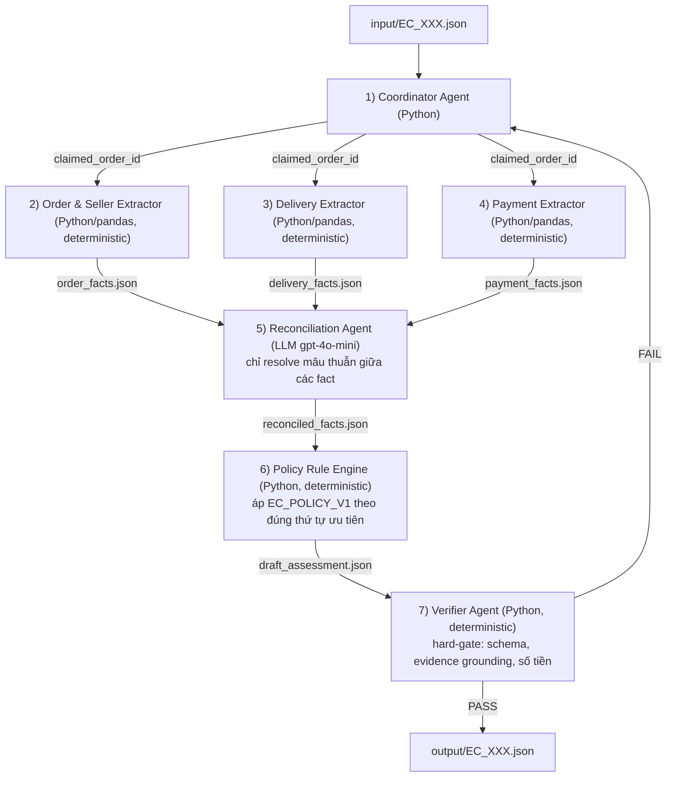

# Architecture v2 — Multi-Agent E-commerce Dispute Resolution (EC_POLICY_V1)

> Cải tiến trực tiếp từ bản đã nộp (73/100). Nguyên tắc cốt lõi: **mọi phép tính/so sánh có thể làm bằng code phải làm bằng code (deterministic)**; LLM (`gpt-4o-mini` qua OpenAI API) chỉ được dùng ở đúng chỗ cần suy luận trên dữ kiện đã được chuẩn hóa — để loại bỏ hoàn toàn nguồn sai số lớn nhất của bản cũ (LLM tự cộng tiền, tự so ngày, tự sinh evidence ID).

## 0. Lưu ý về ràng buộc model

README yêu cầu mỗi agent dùng model **≤ 10B tham số**. `gpt-4o-mini` không công bố chính thức số tham số, nên đây là rủi ro compliance cần bạn tự xác nhận với ban chấm — kiến trúc dưới đây **giảm thiểu rủi ro này** bằng cách chỉ gọi LLM ở **1 agent duy nhất** (Reconciliation Agent) thay vì 3–4 agent như bản cũ, nên nếu phải đổi sang model nhỏ hơn (vd. Qwen2.5-7B-Instruct, Llama-3.1-8B) thì chỉ cần đổi ở một điểm.

## 1. Sơ đồ tổng quan (7 Agents)



## 2. Vai trò từng Agent

### 1. Coordinator Agent (Python)
- Đọc `input/EC_XXX.json`, lấy `claimed_order_id`.
- Gọi tuần tự 2 → 3 → 4 (có thể song song bằng `asyncio`/`concurrent.futures` vì độc lập nhau) → 5 → 6 → 7.
- Giữ toàn bộ state case, ghi 1 dòng vào `trace.jsonl` sau khi Verifier PASS/FAIL.
- Nếu order không tồn tại (`order_facts.order_status == "not_found"`) → **bỏ qua bước 5 (LLM)**, đi thẳng route "no data" tới Policy Rule Engine để tránh gọi LLM vô ích và tránh nó bịa dữ kiện.
- Retry: nếu Verifier FAIL → yêu cầu chạy lại bước 6 tối đa 1 lần; FAIL lần 2 → log `status: "error"` vào trace, **không ghi file output** (thà thiếu 1 case còn hơn output sai schema bị hard gate 0 điểm).

### 2. Order & Seller Extractor (Python/pandas — **không dùng LLM**)
- Join `orders.csv` → `order_items.csv` → `sellers.csv` theo `order_id`.
- Trả về `order_status`, danh sách item `{order_item_id, seller_id, price, freight_value, shipping_limit_date}`.
- **Tính sẵn** `late_sellers: [{seller_id, item_ids: [...]}]` — seller nào có `order_delivered_carrier_date > shipping_limit_date` của item thuộc seller đó (dùng dữ kiện từ Delivery Extractor, xem mục 4).
- Lý do bỏ LLM: đây thuần là join + so sánh, LLM không thêm giá trị mà chỉ thêm rủi ro sai lệch.

### 3. Delivery Extractor (Python/pandas — **không dùng LLM**)
- So sánh `order_delivered_customer_date` vs `order_estimated_delivery_date` → `delivered_late: bool`.
- So sánh `order_delivered_carrier_date` vs `shipping_limit_date` **theo từng item/seller** → `carrier_late_per_seller: {seller_id: bool}`.
- Output thuần là boolean/timestamp, không diễn giải trách nhiệm (việc gán trách nhiệm seller/logistics là của Policy Rule Engine dựa trên bảng quyết định, không phải LLM đoán).

### 4. Payment Extractor (Python/pandas — **không dùng LLM**)
- Tổng `payment_value` theo `order_id`, đếm số dòng payment.
- Tính `item_total = Σ price`, `freight_total = Σ freight_value`, so `payment_total` với `item_total + freight_total` (dung sai 0.10 BRL) — phép cộng/so sánh số học giao hoàn toàn cho code, **không để LLM cộng tiền** (đây là lỗi lớn nhất của bản cũ).

### 5. Reconciliation Agent (LLM `gpt-4o-mini`, OpenAI Structured Outputs) — **agent LLM duy nhất trước quyết định**
- **Input**: `order_facts.json` + `delivery_facts.json` + `payment_facts.json` (đã chuẩn hóa, không có CSV thô, không có câu chữ khiếu nại của khách).
- **Nhiệm vụ duy nhất**: phát hiện & giải quyết mâu thuẫn logic giữa 3 nguồn — ví dụ `order_status = unavailable` nhưng `payment_total = 0` (không hợp lý); hoặc order có nhiều seller, cần xác nhận đúng seller nào bị tính trễ theo quy ước README.
- **Không được** tự tính lại số tiền, tự tạo evidence ID, tự đổi `order_status`. Prompt ràng buộc rõ: chỉ output `conflicts: []` và `notes` giải thích, cộng `conflict_penalty` (0.0–0.3) dùng để trừ vào confidence ở bước 6.
- **Cấu hình kỹ thuật**:
  ```python
  from openai import OpenAI
  from pydantic import BaseModel

  class Conflict(BaseModel):
      field: str
      description: str
      severity: float  # 0.0-0.3

  class ReconciliationOutput(BaseModel):
      conflicts: list[Conflict]
      conflict_penalty: float
      notes: str

  client = OpenAI()
  resp = client.responses.parse(
      model="gpt-4o-mini",
      temperature=0,
      input=[
          {"role": "system", "content": RECONCILIATION_SYSTEM_PROMPT},
          {"role": "user", "content": json.dumps({
              "order_facts": order_facts, "delivery_facts": delivery_facts,
              "payment_facts": payment_facts
          })}
      ],
      text_format=ReconciliationOutput,
  )
  ```
  Dùng `client.responses.parse` (Structured Outputs) với Pydantic model — schema được ép cứng ở tầng API, loại bỏ hoàn toàn rủi ro JSON malformed hay field thừa.
- Nếu `conflicts == []` (đa số case trong bộ 50 vì "không có tình huống mơ hồ giữa nhiều seller") → agent này gần như chỉ pass-through, giữ vai trò kiểm chứng an toàn chứ không làm chậm hệ thống.

### 6. Policy Rule Engine (Python, deterministic — **không dùng LLM**)
- Encode chính xác bảng ưu tiên README thành `if/elif` theo đúng thứ tự: `canceled_order_paid` → `unavailable_order_paid` → `late_delivery_seller` → `late_delivery_logistics` → `valid_split_payment` → `unsupported_late_claim`.
- Vì rule là literal và không mơ hồ (README nói rõ bộ 50 case không có tình huống ambiguous giữa seller), **encode bằng code loại bỏ hoàn toàn rủi ro LLM chọn sai nhánh** — đây là điểm cải thiện lớn nhất cho cột `primary_issue` (20%) và `financial_resolution` (20%).
- Tự sinh `evidence_ids` **bằng code**, lấy trực tiếp từ ID có sẵn trong `order_facts`/`payment_facts` (không có bước nào để LLM viết tay ID) → giải quyết lỗi false-positive evidence của bản cũ.
- Tính `confidence`:
  ```python
  confidence = 0.95 - conflict_penalty - (0.1 if order_has_no_items else 0)
  confidence = round(max(0.5, min(0.99, confidence)), 2)
  ```
  công thức tường minh, tái lập được — thay vì "based on clarity" mơ hồ như bản cũ.
- Output đúng `draft_assessment` theo schema mục 6 README (Pydantic model `EcOutput`).

### 7. Verifier Agent (Python, deterministic — **không dùng LLM**)
- Validate Pydantic schema chặt (kiểu dữ liệu, field bắt buộc).
- **Grounding check**: mỗi evidence ID trong `evidence_ids` phải tồn tại trong `order_facts`/`payment_facts` gốc (không chỉ đúng định dạng regex — bản cũ chỉ check giới hạn số lượng, đây là lỗ hổng chính khiến "Evidence IDs" 15% dễ mất điểm).
- Check giới hạn: ≤5 ID/entity set, ≤10 evidence, ≤3 causes, ≤3 responsible parties, ≤5 actions.
- Check số tiền khớp action: `refund_freight` → `recommended_refund_brl == freight_total_brl`; `issue_full_refund` → `== payment_total_brl`; các action không hoàn tiền → `== 0.0`. Đây là lỗi tinh vi dễ bị bỏ sót nếu chỉ check "có mặt field" mà không check đúng công thức theo action.
- Làm tròn 2 chữ số cuối cùng trước khi ghi file.
- PASS → ghi `output/EC_XXX.json`. FAIL → trả lý do cụ thể (field nào, giá trị nào sai) về Coordinator.

## 3. Ma trận truy cập dữ liệu

| Agent | orders/order_items/sellers CSV | order_payments CSV | Gọi LLM |
|---|---|---|---|
| Coordinator | ❌ | ❌ | ❌ |
| Order & Seller Extractor | ✅ | ❌ | ❌ |
| Delivery Extractor | ✅ | ❌ | ❌ |
| Payment Extractor | ❌ | ✅ | ❌ |
| Reconciliation Agent | ❌ (chỉ nhận facts đã trích) | ❌ | ✅ `gpt-4o-mini` |
| Policy Rule Engine | ❌ | ❌ | ❌ |
| Verifier | ❌ (đối chiếu lại facts đã có sẵn trong state) | ❌ | ❌ |

## 4. Handoff — Pydantic schema xuyên suốt

Toàn bộ dữ liệu giữa các agent là Pydantic model (`OrderFacts`, `DeliveryFacts`, `PaymentFacts`, `ReconciliationOutput`, `EcOutput`) serialize qua `.model_dump_json()`. Chỉ riêng lời gọi LLM ở bước 5 dùng OpenAI Structured Outputs để ép schema đầu ra ở tầng API — không có bước nào parse JSON tự do từ text response của LLM.

## 5. Vì sao bản này sửa đúng lỗi đã mất điểm ở bản cũ

| Lỗi bản cũ | Sửa trong bản v2 |
|---|---|
| 3 agent LLM tự cộng tiền, tự so ngày | Chuyển hết sang Python/pandas deterministic (mục 2, agent 2–4) |
| Order&Seller và Delivery cùng phán "seller trễ", không ai chốt | Delivery chỉ trả boolean, việc gán trách nhiệm chỉ do Policy Rule Engine quyết theo đúng 1 bảng quy tắc |
| Không có bước đối soát mâu thuẫn trước Policy | Thêm Reconciliation Agent (agent 5), input/output ràng buộc chặt bằng Pydantic |
| Không rõ cách sinh evidence ID | Sinh 100% bằng code từ ID có sẵn trong facts, LLM không được chạm vào |
| Verifier chỉ check giới hạn số lượng | Thêm grounding check (ID phải tồn tại thật) + check công thức số tiền theo từng action |
| `confidence` mơ hồ | Công thức tường minh, tái lập được |
| Policy Agent là LLM tự suy luận thứ tự ưu tiên | Chuyển thành rule engine code, loại bỏ rủi ro chọn sai nhánh |
