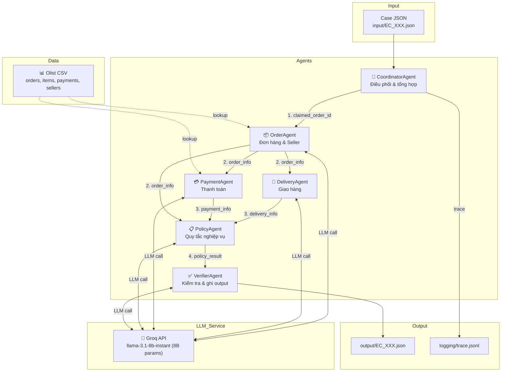

# Multi-Agent Architecture — E-commerce Dispute Resolution

## Tổng quan

Hệ thống multi-agent xử lý 50 khiếu nại khách hàng thương mại điện tử trên dữ liệu Olist.
Mỗi agent chuyên trách một domain dữ liệu, truy vấn dữ liệu từ CSV và gửi context cho **LLM Model (`llama-3.1-8b-instant` - 8B parameters qua Groq REST API)** để phân tích, đưa ra suy luận (reasoning) và ra quyết định. Kết quả được handoff giữa các agent qua Python dict, và Coordinator điều phối toàn bộ pipeline.

## Sơ đồ kiến trúc



## Vai trò từng Agent & Tích hợp LLM

### 1. CoordinatorAgent (`src/agents/coordinator_agent.py`)
- **Vai trò:** Điều phối pipeline, nhận case input, gọi lần lượt các agent chuyên biệt.
- **Quyền truy cập dữ liệu:** Không truy cập CSV trực tiếp.
- **Input:** Case JSON.
- **Output:** Output JSON hoàn chỉnh + trace entries.
- **Handoff:** Gọi OrderAgent → DeliveryAgent → PaymentAgent → PolicyAgent → VerifierAgent.

### 2. OrderAgent (`src/agents/order_agent.py`)
- **Vai trò:** Truy vấn trạng thái đơn hàng, danh sách sản phẩm, seller và mốc thời gian từ CSV, sau đó gọi LLM để phân tích cấu trúc đơn hàng.
- **Quyền truy cập dữ liệu:** `orders`, `order_items`, `sellers`.
- **LLM Call:** Gửi prompt tổng hợp thông tin đơn hàng cho LLM (`llama-3.1-8b-instant`) để đánh giá.
- **Output:** `order_info` dict (status, items, sellers, totals, timestamps, llm_analysis).
- **Handoff → DeliveryAgent, PaymentAgent, PolicyAgent**

### 3. DeliveryAgent (`src/agents/delivery_agent.py`)
- **Vai trò:** Phân tích thời gian giao hàng thực tế so với dự kiến và mốc bàn giao của seller để xác định trách nhiệm (seller vs logistics provider).
- **LLM Call:** Gửi mốc timestamps và shipping limits cho LLM phân tích logic giao trễ.
- **Output:** `delivery_info` dict (is_late, is_seller_late, late_seller_ids, llm_reasoning).
- **Handoff → PolicyAgent**

### 4. PaymentAgent (`src/agents/payment_agent.py`)
- **Vai trò:** Phân tích các dòng thanh toán từ CSV và gọi LLM đối soát với giá trị đơn hàng (items + freight).
- **LLM Call:** Gửi thông tin các dòng thanh toán cho LLM để kiểm tra tính khớp (reconciled) và phát hiện split payment.
- **Output:** `payment_info` dict (payment_total, is_reconciled, has_split_payment, llm_reasoning).
- **Handoff → PolicyAgent**

### 5. PolicyAgent (`src/agents/policy_agent.py`)
- **Vai trò:** Áp dụng bộ quy tắc `EC_POLICY_V1` dựa trên bằng chứng từ 3 agent trên để đưa ra quyết định giải quyết khiếu nại.
- **LLM Call:** Gửi toàn bộ bằng chứng (order, delivery, payment) và 6 quy tắc nghiệp vụ cho LLM phân tích theo thứ tự ưu tiên.
- **Output:** `policy_result` dict (primary_issue, refund, actions, root_cause, llm_reasoning).
- **Handoff → VerifierAgent**

### 6. VerifierAgent (`src/agents/verifier_agent.py`)
- **Vai trò:** Xây dựng output JSON, kiểm tra định dạng evidence ID, validate giới hạn mảng (max limits) và gọi LLM kiểm tra tính hợp lệ của schema.
- **LLM Call:** Gửi output JSON hoàn chỉnh cho LLM thẩm định tính chính xác trước khi ghi file.
- **Output:** JSON file trong `output/`.

## Luồng Handoff

```
Case JSON
  │
  ▼
CoordinatorAgent
  │
  ├──► OrderAgent.analyze(order_id)
  │     │ (Data Query + LLM call)
  │     ▼ order_info
  │     ├──► DeliveryAgent.analyze(order_info)
  │     │     │ (LLM call)
  │     │     ▼ delivery_info
  │     │
  │     └──► PaymentAgent.analyze(order_id, order_info)
  │           │ (Data Query + LLM call)
  │           ▼ payment_info
  │
  ├──► PolicyAgent.analyze(order_info, delivery_info, payment_info)
  │     │ (LLM Policy call)
  │     ▼ policy_result
  │
  └──► VerifierAgent.build_and_verify(...)
        │ (LLM Verification call)
        ▼ output JSON file
```

## Quy tắc nghiệp vụ (EC_POLICY_V1)

Áp dụng theo thứ tự ưu tiên:

| # | Primary Issue | Root Cause Code | Responsible | Refund | Action |
|---|--------------|-----------------|-------------|--------|--------|
| 1 | canceled_order_paid | ORDER_CANCELED_AFTER_PAYMENT | platform | Full payment | issue_full_refund |
| 2 | unavailable_order_paid | ORDER_UNAVAILABLE_AFTER_PAYMENT | platform | Full payment | issue_full_refund |
| 3 | late_delivery_seller | SELLER_HANDOFF_AFTER_LIMIT | seller | Freight | refund_freight |
| 4 | late_delivery_logistics | CARRIER_DELIVERED_AFTER_ESTIMATE | logistics | Freight | refund_freight |
| 5 | valid_split_payment | MULTIPLE_PAYMENTS_RECONCILED | — | 0 | explain_valid_split_payment |
| 6 | unsupported_late_claim | DELIVERY_WITHIN_ESTIMATE | — | 0 | reject_late_refund |

## Technology Stack

- **Ngôn ngữ:** Python 3.13 (stdlib + Groq REST API)
- **Mô hình LLM:** `llama-3.1-8b-instant` (8B parameters ≤ 10B parameters limit)
- **Provider API:** Groq Cloud API (`https://api.groq.com/openai/v1/chat/completions`)
- **Data access:** `csv.DictReader` → in-memory dict lookup O(1)
- **Trace format:** JSONL (6 entries per case = 300 entries total)
